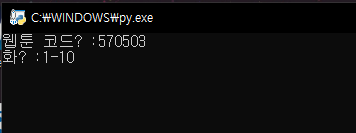

## NToonDownloader
네이버 웹툰을 다운로드 할 수 있습니다.

### 사용법
main.py가 있는 곳에 **downloads** 폴더를 만듭니다.

`https://comic.naver.com/webtoon/detail.nhn?titleId=570503&no=291&weekday=thu` 
웹툰 주소에서 **titleId** 파라미터가 웹툰 코드입니다.   
웹툰 코드에 **titleId** 파라미터 값을 입력하고, **화**에는 다운로드 할 화를 입력합니다.  
여러 화도 -로 설정할 수 있습니다. (1-3을 입력하면 1에서 3화를 다운로드합니다.) 

